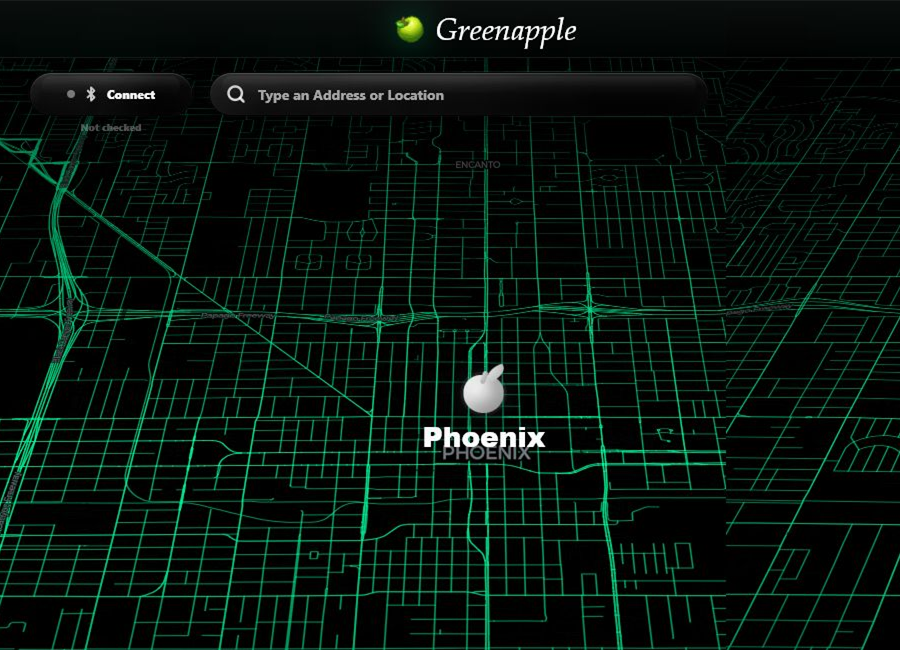

# Greenapple 🍏

  

Greenapple is a native Windows map tool for testing location changes and route movement on connected developer devices. It has a dark map UI, saved places, route playback, patrol routes, and a WebView2 desktop shell.

No accounts. No subscriptions. No telemetry.

  

## Table of Contents

- [Download](#download)
- [About The Project](#about-the-project)
- [Features](#features)
- [Contact](#contact)

## Download

[Download Greenapple for Windows](https://github.com/jocosely/Greenapple/releases/download/v0.1.0/Greenapple-v0.1.0.exe)

Open the `.exe` and the full interface runs inside the desktop app. No browser tab, no localhost page, and no account setup.

## About The Project

Greenapple is meant to be a clean local app for map-based location testing. It focuses on a simple workflow: connect a developer device, pick a place or route on the map, and run that movement from the desktop.

Main features:

- Static location changes
- Route playback
- Patrol routes
- Saved and recent places
- Route speed controls
- Local app settings
- Native Windows WebView2 app

(<a href="#readme-top">back to top</a>)

## Features ✨

### Static location

Static mode is for holding one selected location during testing. You can click the map, search for a place, or move the marker and keep that point active.

- Shows the selected place name on the map.
- Keeps the marker visible while you work.
- Saves recent places locally for quick reuse.
- Includes optional small GPS drift for more natural movement tests.

### Route playback

Route mode is for testing movement between two points. Pick a start, pick a destination, preview the path, then start the route.

- Road mode follows routed driving paths when route data is available.
- Boat mode allows direct water or off-road movement.
- Speed can be adjusted before or during movement.
- Route progress, distance, and estimated timing are shown in the controls.
- Routes can pause, resume, stop, or hold at the destination.

### Patrol routes

Patrol mode is for repeated movement across multiple stops. Add points in order and Greenapple can loop through them for longer tests.

- Useful for repeated location checks.
- Supports multi-stop paths instead of only point-to-point movement.
- Can loop back to the first point.
- Keeps the route visible while editing.

### Saved and recent places

Saved and recent places reduce repeat setup. Locations are kept locally so common test spots are easy to open again.

- Bookmark important locations.
- Open recent test locations quickly.
- Keep favorite spots separate from temporary route points.
- No account or cloud sync is required.

### Local settings

Settings are stored on the computer running the app. Greenapple is built to stay local-first and avoid account-based setup.

- Theme colors can be adjusted.
- Device display name can be changed.
- Route speed preferences are kept locally.
- Saved places and app preferences stay on the machine.

### Native Windows build

Greenapple runs as a native Windows WebView2 app. The release build ships as a `.exe` with the UI bundled into the app package.

- No browser tab or localhost UI is required for the packaged app.
- The native app loads the bundled interface directly inside the `.exe` window.
- Includes the Windows app icon and native window controls.

### Device tooling hooks

The desktop bridge is set up for local developer-device tooling. Python command paths can be configured through environment variables, and device logs or local virtual environments are not meant to be committed.

- Local command hooks are kept separate from the UI.
- Python paths can be configured per machine.
- Build output does not include local virtual environments.
- Privacy notes are documented in [PRIVACY.md](PRIVACY.md).

(<a href="#readme-top">back to top</a>)

## Contact

Discord - `hidings.`

Project Link: [https://github.com/jocosely/Greenapple](https://github.com/jocosely/Greenapple)

(<a href="#readme-top">back to top</a>)

